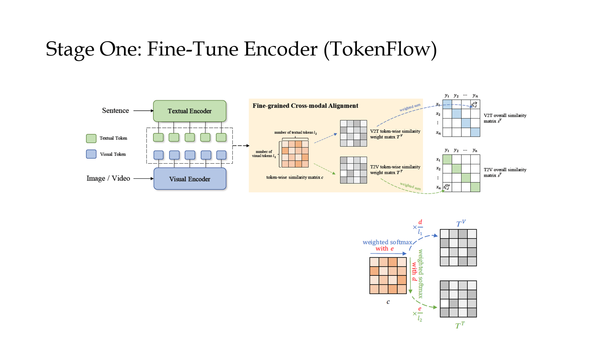
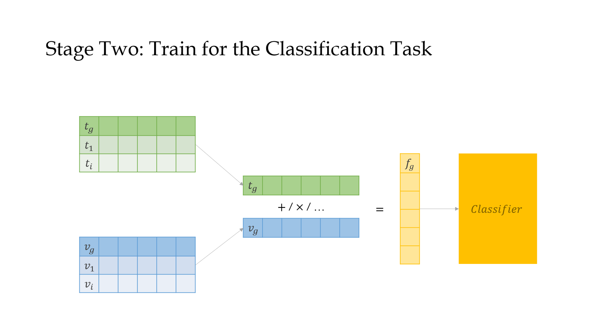

# Prompting Attributes for FGVC

## Framework





## Prerequisites

```
pytorch
torchvision
timm
yacs
regex
ftfy
tqdm
```

## Dataset

### Download

[Caltech-UCSD Birds-200-2011 (CUB-200-2011)](http://www.vision.caltech.edu/datasets/cub_200_2011/)

Alternative

[CUB-200-2011 | Kaggle](https://www.kaggle.com/datasets/wenewone/cub2002011)

Directory

```
+---ROOT
|   +---cub2002011/
|   |   +---CUB_200_2011/		# from https://data.caltech.edu/records/20098
|   |   |   +---attributes/
|   |   |   |   +---attributes.txt		# NOTICE: attributes.txt has been moved to here
|   |   |   |   +--- ...
|   |   |   |   \---image_attribute_labels_clean.txt	# cleaned image_attribute_labels.txt
|   |   |   +---images/
|   |   |   +---parts/
|   |   |   +---bounding_boxes.txt
|   |   |   \--- ...
|   |   +---cvpr2016_cub/	# unused at present
|   |   \---segmentations/	# unused at present
```


## Train

### Run Locally

```bash
torchrun --nproc_per_node=2 train.py -n "test1" -c configs/cub.yml MODEL.PRETRAIN_FILE 'ViT-B-16.pt' MODEL.PRETRAIN_PATH './pretrained'
```

### Run on Virtaicloud
```bash
torchrun --nproc_per_node=2 $GEMINI_RUN/Prompt/train.py \
-n "test1" -i "First try"   \
-c $GEMINI_RUN/Prompt/configs/cub.yml   \
OUTPUT_DIR $GEMINI_DATA_OUT DATA.DATASET.ROOT_DIR $GEMINI_DATA_IN1  \
MODEL.PRETRAIN_PATH $GEMINI_PRETRAIN MODEL.PRETRAIN_FILE 'ViT-B-16.pt'
```
Dev
```bash
torchrun --nproc_per_node=2 $GEMINI_RUN/Prompt/train.py \
-n "test1_2" -i "Check stage 1"   \
-c $GEMINI_RUN/Prompt/configs/cub.yml   \
OUTPUT_DIR $GEMINI_DATA_OUT DATA.DATASET.ROOT_DIR $GEMINI_DATA_IN1  \
MODEL.PRETRAIN_PATH $GEMINI_PRETRAIN \
TRAIN.STAGE1.MAX_EPOCHS 5 TRAIN.STAGE2.MAX_EPOCHS 100
```

### Fine-Tune
```bash
torchrun --nproc_per_node=2 $GEMINI_RUN/Prompt/fine_tune.py \
-n "test2" -i "Tuning stage 2"   \
-c $GEMINI_RUN/Prompt/configs/cub.yml   \
OUTPUT_DIR $GEMINI_DATA_OUT DATA.DATASET.ROOT_DIR $GEMINI_DATA_IN1  \
MODEL.PRETRAIN_PATH $GEMINI_PRETRAIN
```
Dev
```bash
torchrun --nproc_per_node=2 $GEMINI_RUN/Prompt/fine_tune.py \
-n "test3" -i "Tuning lr for stage 2"   \
-c $GEMINI_RUN/Prompt/configs/cub.yml   \
OUTPUT_DIR $GEMINI_DATA_OUT DATA.DATASET.ROOT_DIR $GEMINI_DATA_IN1  \
MODEL.PRETRAIN_PATH $GEMINI_DATA_OUT
```

## To Tune

### 1. Hyper-Params for Prompting

- Dropout rate in text description: `DATA.DATASET.DROP_RATE`

- Temperature in TokenFlow: `MODEL.LAMB`

### 2. Classifier

####  2. 1. How to utilise features from all tokens?

**Global Tokens Only**

- element-wise multiplication
- sum

**Blending Patches & Words**

- TODO

#### 2.2.  Classifier Structure

- Hidden dim: `MODEL.HIDDEN_DIM`
- Module

#### 2.3. Ablation Study

- [ ] Visual Only ->  Effect of Stage One

## Acknowledgement

Codebase from [CLIP](https://github.com/openai/CLIP), [Swin-Transformer](https://github.com/microsoft/Swin-Transformer)
